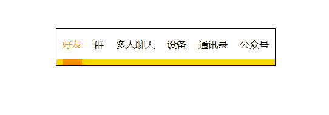

整理平时自己写的一些好玩的小demo。

##### navigator.html
导航条动画

##### ball.html
面向对象与JS动画

##### scale.html
CSS动画

##### pseudo.html
CSS伪元素

##### validator.js
Angular1表单校验类，策略模式。

##### currying.js
函数柯里化。

##### subscribe.js
订阅者模式

##### sport.js
运动框架

##### negativeMargin.html
负margin的应用

