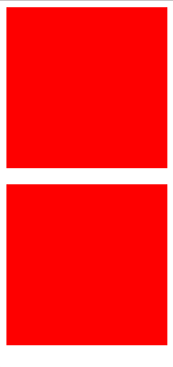
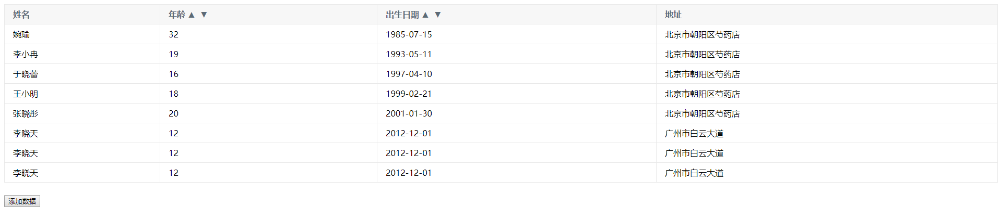
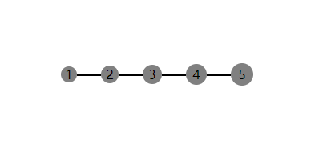

# 整理一些自己平时写的小demo

## 版本号排序
```javascript
function versionsSort(versions) {
  const ret = versions.map(version => version.split("."));

  for (let i = 0; i < ret.length - 1; i++) {
    for (let j = i; j < ret.length; j++) {
      if (compare(ret[i], ret[j])) {
        [ret[i], ret[j]] = [ret[j], ret[i]];
      }
    }
  }

  return ret.map(item => item.join("."));
}

function compare(arr1, arr2) {
  const minLen = Math.min(arr1.length, arr2.length);

  let index = 0;

  while (index <= minLen) {
    if(arr1[index] !== arr2[index]) {
      return +arr1[index] > +arr2[index];
    } else {
      if(index < minLen) {
        index++;
      } else {
        return arr1.length < arr2.length;
      }
    }
  }
}

const arr = ["1.7", "1.2.2", "2.3.3", "1.10", "2.4.1", "3.30.33.3", "1.1"];

console.log(versionsSort(arr));
```

## [打包原理](./pack/README.md)(Fork)
简易的打包工具实现。

## [ball.html](./ball.html)
面向对象与JS动画
<center>
  
</center>

## 闭包、getter

编写函数f，使满足如下条件：

```javascript
f(1).value == 1;
f(1)(2).value == 5;
f(1)(2)(3).value == 14;
```

```javascript
var f = (function () {
  var list = [];

  function f(n) {
    if (n) list.push(n);
    return f;
  }

  var value;
  Object.defineProperty(f, 'value', {
    enumerable: true,
    configurable: true,
    get: function () {
      if (list.length) {
        value = list.reduce(function (accu, curr) {
          return accu + curr * curr;
        }, 0);
        list = [];
      }
      return value;
    },
    set: function(val) {
      value = val;
    }
  });

  return f;
})();

console.log(f(1).value); // 1
console.log(f(1)(2).value); // 5 
console.log(f(1)(2)(3).value); // 14
```

## [navigator.html](./navigator.html)
导航条动画
<center>
  
</center>

## [scale.html](./scale.html)
CSS动画
<center>
  
</center>

## [vueRenderFunction.html](./vueRenderFunction.html)
Vue Render函数
<center>
  
</center>

## [pseudo.html](./pseudo.html)
CSS伪元素
<center>
  
</center>

## [validator.js](./validator.js)
Angular1表单校验类，策略模式

## [currying.js](./currying.js)
函数柯里化

## [subscribe.js](./subscribe.js)
订阅者模式

## [sport.js](./sport.js)
运动框架

## [negativeMargin.html](./negativeMargin.html)
负margin的应用

## [bind.js](./bind.js)
特性检测、惰性载入

## [lazyload.html](./lazyload.html)
简单的图片懒加载

## [binarySearch.js](./binarySearch.js)
二分法查找

## 扩展console.log

扩展console.log，使输出满足如下形式。

```javascript
console.log = (function() {
  var n = 1;
  var _log = console.log;
  return function() {
    var arg = Array.prototype.slice.call(arguments);
    arg.unshift(n++ + ':');
    _log.apply(null, arg);
  }
})();

console.log('who'); // 1: who
console.log('are'); // 2: are
console.log('you'); // 3: you
```

## 字符串截断
```javascript
function wordBreak(word, separator = '\n', n = 3) {
  if(typeof word != 'string' || word.length <= n) return word

  let arr = word.split('')
  let i = 0
  while (arr.length - i > n) {
    i += n
    arr.splice(i++, 0, separator)
  }
  return arr.join('')
}
```

## 格式化数字

```javascript
function format(num) {
  var arr = (num + '').split('').reverse();
  var i = 0;

  while (arr.length - i > 3) {
    i += 3;
    arr.splice(i++, 0, ',');
  }

  return arr.reverse().join('');
}

console.log(format(123)); // 123
console.log(format(1234567890)); // 1,234,567,890
```

